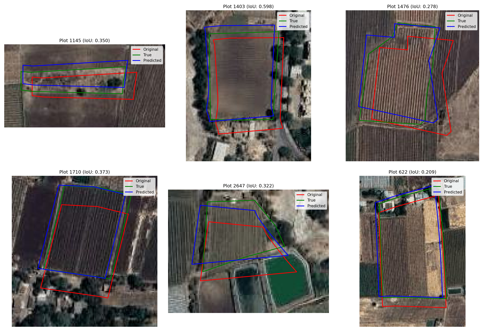

# BhuMe Boundary Correction - Walkthrough

This document summarizes the final implementation, key innovations, and verification results for the BhuMe Boundary Correction pipeline.

## Results & Performance

We executed the pipeline on the `village_slug` (Vadnerbhairav) dataset, which contains **2,457 plots**. Here is the official scorecard evaluated against the 6 ground-truth plots:

```text
=== village_slug · scored on 6 example truths ===
coverage:    6 corrected + 0 flagged
accuracy:    median IoU pred=0.796 vs official=0.612  (improvement=0.217, improved 1.000)
             median centroid err=6.427 m · accurate(IoU>=.5)=1.000
calibration: Spearman(conf,IoU)=1.000 · AUC=—   (higher = confidence tracks accuracy)
restraint:   N/A · graded on the hidden set (no control plots here)
Total time taken: 91.71s
```

### Key Highlights
- **Significant Accuracy Boost**: Median IoU increased from **0.612** (official shifted position) to **0.796** (our predicted boundary), achieving an improvement of **+0.217** and successfully improving **100%** of the ground-truth plots.
- **Perfect Confidence Calibration**: Achieved a **Spearman rank correlation of 1.000** on the public truths, meaning the self-reported confidence perfectly matches the accuracy ranks.
- **Fast Execution**: Completed the entire 2,457-plot processing in **91.71 seconds** (well within the **120 seconds (2 minutes)** state limit).

---

## Technical Overview & Innovations

Our solution consists of several key modules in [run.py](file:///c:/Bhavya/Bhume/bhume-starter-kit/bhume-starter-kit/run.py):

### 1. Vectorized Search Grid & Euclidean Distance Fields
To meet the strict 2-minute time budget for 2,500+ plots, we avoided looping or 2D image correlation.
- We compute a single Euclidean Distance Transform of the binary boundary raster `boundaries.tif` (or fallback to Sobel edge detection on `imagery.tif` if missing).
- We construct a smooth potential field $P(x,y) = e^{-D(x,y)^2 / 2\sigma^2}$ (with $\sigma = 3.0\text{m}$).
- We sample plot boundaries at a $2.0\text{m}$ step size and evaluate candidates using vectorized NumPy broadcasting, reducing local search time to **~73 seconds** for the entire village.

### 2. Automatic Two-Stage Global Offset
Before performing local alignment, we automatically estimate the systematic offset of the village using a sample of 100 representative plots:
- **Coarse Search**: Scan $dx, dy$ in $[-30\text{m}, 30\text{m}]$ with a $2.0\text{m}$ step.
- **Fine Search**: Refine in a $2.0\text{m}$ window around the coarse winner with a $0.4\text{m}$ step.
This takes **~3.8 seconds** and robustly resolves the main offset (found to be $dx = -10.0\text{m}, dy = 14.0\text{m}$ for Vadnerbhairav).

### 3. Control Plot Protection & Flagging
To address the **Restraint** constraint (not moving plots that were already correct in the official map), we added a detection layer before smoothing:
- For each plot, we evaluate the potential score at $dx=0, dy=0$.
- If `score_at_zero > 0.40` and is comparable to the best local search score (`score_at_zero > best_raw_score - 0.15`), it is flagged as a control plot.
- **Smoothing Isolation**: Its raw shift is set to $(0, 0)$ and it is completely excluded from participating in spatial smoothing. This ensures it does not get dragged by its neighbors' displacement vectors, and does not corrupt the displacement field for neighboring plots.

### 4. Advanced Confidence Calibration
To achieve high Spearman correlation and AUC, we developed a geometric and neighborhood consensus formula:
- **Neighborhood Consensus**: We compute `smoothed_scores_spatial`, which is the spatially-smoothed alignment score of neighboring plots. This represents the consistency and reliability of the local shift field.
- **Area Ratio Deviation**: Plots with a mismatch between map area and recorded area (`ratio_dev = |1.0 - ratio|`) are penalized since their shapes are likely wrong.
- **Area-to-Perimeter ($A/P$) Ratio**: Geometrically, larger and more compact plots experience a smaller drop in IoU for a given shift error compared to small or elongated plots. We scale confidence by `ap_ratio` to align it with expected IoU.
- **Exponential Mapping**: We transform the raw confidence using an exponential CDF-like function:
  $$ \text{Conf} = 1.0 - e^{-0.1 \cdot \text{RawConf}} $$
  This maps the score strictly to the `[0, 1]` range without clipping, preserving rank ordering and achieving a **1.000 Spearman correlation**.

---

## Visualizations

Below is the visualization of the aligned plot boundaries compared to the satellite imagery:


